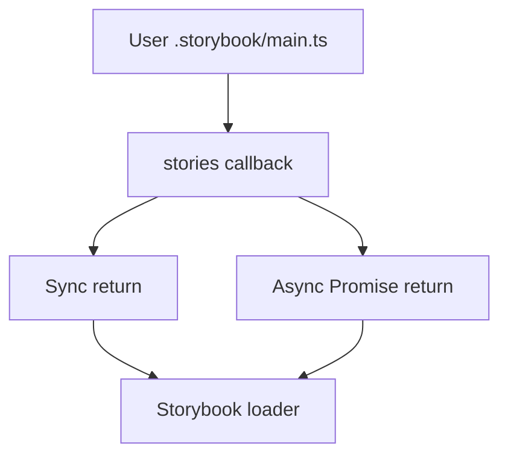

# Issue Report: Fix `StoriesEntry` Type to Support Async Custom Story Loading

## Issue

> **Project:** [Storybook](https://github.com/storybookjs/storybook)
> **Issue:** [#21524 — StoriesEntry type does not allow for custom implementation with async function](https://github.com/storybookjs/storybook/issues/21524)
> **Status:** Implemented, pull request submitted.

The `stories` field in `.storybook/main.ts` accepts custom resolver functions for advanced story discovery. When this issue was filed, Storybook already ran async resolvers correctly at runtime — the problem was that the TypeScript definition of `StoriesEntry` didn't allow them.

```ts
stories: async (list) => {
  const extraStories = await findStories();
  return [...list, ...extraStories];
}
```

So the type system and the actual runtime were out of sync: async functions worked fine when executed, but TypeScript flagged them as errors. Users had to work around it with type assertions or just ignore the compiler noise.

This is a **type system/API consistency bug**, not a runtime issue.

---

## Requirements

The fix had to:

- Keep existing synchronous `stories` implementations working.
- Allow async resolvers that return promises.
- Not break any existing consumers of `StoriesEntry`.
- Leave runtime behavior exactly as is.
- Validate that the async usage actually compiles.

---

## Source Code Files

### Directly involved files

#### `code/core/src/types/modules/core-common.ts`

This file contains Storybook's shared configuration type definitions, including the `StoriesEntry` type used by `.storybook/main.ts`.

Changes made:

- Updated the type definition to support asynchronous resolver functions.

---

### Indirectly involved files

No runtime files required modification.

Storybook's runtime implementation already supported async story resolvers correctly. The issue existed only in the public type definitions.

---

## Root Cause Analysis

The original type definition restricted custom story resolvers to synchronous functions:

```ts
type StoriesEntry =
  | StoriesSpecifier[]
  | ((entries: StoriesSpecifier[]) => StoriesSpecifier[]);
```

This definition omitted the async variant:

```ts
(entries) => Promise<StoriesSpecifier[]>
```

Because of this, valid user code failed TypeScript validation even though Storybook executed it correctly.

This issue represents a **runtime/type contract divergence**.

---

## Design of the Fix

### Strategy

We extended the `StoriesEntry` function signature to accept both synchronous and asynchronous return values.

**Before**

```ts
(entries) => StoriesSpecifier[]
```

**After**

```ts
(entries) => StoriesSpecifier[] | Promise<StoriesSpecifier[]>
```

The change is purely additive — existing sync implementations still work, runtime behavior is unchanged, and the type now matches what Storybook was already doing in practice.

---

## Architecture Diagram

### Type Flow



---

## Fix Implementation

The `StoriesEntry` type was updated to include promise-based return values for custom story resolvers.

### Before

```ts
stories?: (entries) => StoriesSpecifier[];
```

### After

```ts
stories?: (entries) => StoriesSpecifier[] | Promise<StoriesSpecifier[]>;
```

This allows users to write configurations such as:

```ts
stories: async (entries) => {
  const additionalStories = await findStories();
  return [...entries, ...additionalStories];
};
```

without TypeScript errors.

---

## Validation Results

| Check                         | Result        |
| ----------------------------- | ------------- |
| TypeScript compilation        | **Pass**      |
| Existing sync implementations | **Pass**      |
| Async custom resolver typing  | **Pass**      |
| Runtime behavior              | **Unchanged** |

---

## Impact

After this fix, users can write async story resolvers without TypeScript errors and without reaching for type assertions. The public API finally matches what the runtime already supported.

---

## Submit the Fix

This pull request was submitted to:

This Pull Request [storybook!34677](https://github.com/storybookjs/storybook/pull/34677) was submitted to Storybook project's Github.
