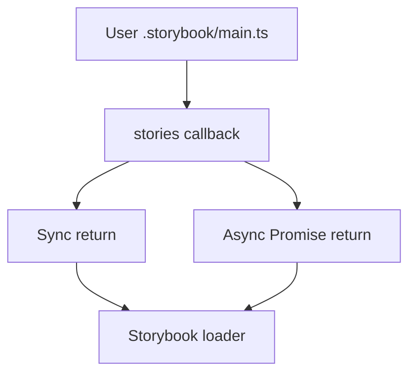

# Issue Report: Fix `StoriesEntry` Type to Support Async Custom Story Loading

## Issue

> **Project:** :contentReference[oaicite:0]{index=0}  
> **Issue:** #21524 — *StoriesEntry type does not allow for custom implementation with async function*  
> **Pull Request:** #34677  
> **Status:** Implemented, pull request submitted.

The Storybook configuration system allows users to provide custom implementations for the `stories` field in `.storybook/main.ts`, enabling advanced story discovery logic.

At the time this issue was filed, Storybook's runtime behavior already supported asynchronous story resolvers such as:

```ts
stories: async (list) => {
  const extraStories = await findStories();
  return [...list, ...extraStories];
}
```

However, the TypeScript definition of `StoriesEntry` did not permit this usage.

This created an inconsistency between:

- The actual runtime behavior (async functions worked correctly)
- The public TypeScript API (async functions produced type errors)

As a result, users attempting valid async custom story loading received incorrect compile-time errors, forcing them to use type assertions or unsafe workarounds.

This is primarily a **type system/API consistency bug**, not a runtime implementation defect.

---

## Requirements

The fix needed to satisfy the following requirements:

- Preserve existing synchronous `stories` implementations.
- Allow asynchronous custom story resolvers returning promises.
- Avoid breaking existing consumers of the `StoriesEntry` type.
- Keep runtime behavior unchanged.
- Update type definitions only where necessary.
- Validate that async usage compiles successfully.

---

## Source Code Files

### Directly involved files

#### `code/core/src/types/modules/core-common.ts`

This file contains Storybook's shared configuration type definitions, including the `StoriesEntry` type used by `.storybook/main.ts`.

Changes made:

- Updated the type definition to support asynchronous resolver functions.

---

### Indirectly involved files

No runtime files required modification.

Storybook's runtime implementation already supported async story resolvers correctly. The issue existed only in the public type definitions.

---

## Root Cause Analysis

The original type definition restricted custom story resolvers to synchronous functions:

```ts
type StoriesEntry =
  | StoriesSpecifier[]
  | ((entries: StoriesSpecifier[]) => StoriesSpecifier[]);
```

This definition omitted the async variant:

```ts
(entries) => Promise<StoriesSpecifier[]>
```

Because of this, valid user code failed TypeScript validation even though Storybook executed it correctly.

This issue represents a **runtime/type contract divergence**.

---

## Design of the Fix

### Strategy

The solution was to extend the `StoriesEntry` function signature so that it accepts both synchronous and asynchronous return values.

Conceptually:

**Before**

```ts
(entries) => StoriesSpecifier[]
```

**After**

```ts
(entries) => StoriesSpecifier[] | Promise<StoriesSpecifier[]>
```

This approach was chosen because:

- It preserves backward compatibility.
- It aligns the type system with actual runtime behavior.
- It introduces zero runtime behavior changes.
- It minimizes implementation scope.

---

## Architecture Diagram

### Type Flow



---

## Fix Implementation

The `StoriesEntry` type was updated to include promise-based return values for custom story resolvers.

### Before

```ts
stories?: (entries) => StoriesSpecifier[];
```

### After

```ts
stories?: (entries) => StoriesSpecifier[] | Promise<StoriesSpecifier[]>;
```

This allows users to write configurations such as:

```ts
stories: async (entries) => {
  const additionalStories = await findStories();
  return [...entries, ...additionalStories];
};
```

without TypeScript errors.

---

## Validation Results

| Check                         | Result        |
| ----------------------------- | ------------- |
| TypeScript compilation        | **Pass**      |
| Existing sync implementations | **Pass**      |
| Async custom resolver typing  | **Pass**      |
| Runtime behavior              | **Unchanged** |

---

## Impact

This fix improves Storybook's developer experience by ensuring that the public TypeScript API matches the runtime capabilities already supported by the framework.

It removes the need for unsafe casts in advanced Storybook configurations and formally supports asynchronous story discovery patterns.

---

## Submit the Fix

This pull request was submitted to :contentReference[oaicite:1]{index=1}:

- **Pull Request:** #34677  
- **Issue:** #21524